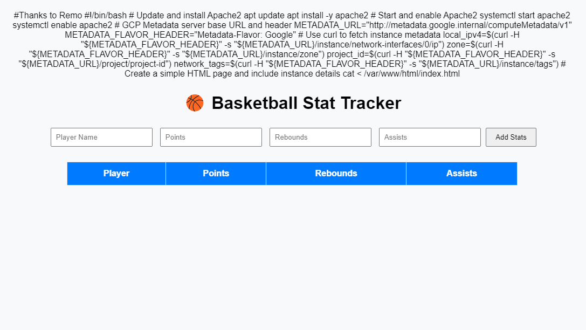

# gcp-hooptracker-webserver

## This is an HTML script that displays Google Cloud Platform webserver data and displays a simple basketball tracker that utilizes JavaScript to save player information.

